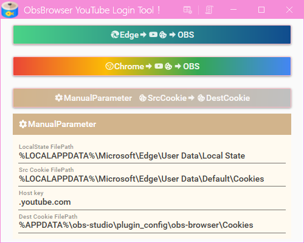

# ObsBrowserYouTubeLoginTool

OBSの内部ブラウザでYouTubeにログインできるツール🛠です  
このツールを使うことで、YouTubeのメンバー限定チャットの取り込みなどがOBSで可能になります  
  
 

## インストール方法
[リリースページ](https://github.com/Kanna-mimimin/ObsBrowserYouTubeLoginTool/releases)から最新版の「ObsBrowserYouTubeLoginTool-Ver〇.〇.〇.zip」をダウンロードしてお好みの場所に展開するだけ！  
  

## 使い方🔰
1. 事前にEdgeまたはChromeでYouTubeにログインしておく🔑
  

1. OBSが起動中の場合は終了しておく  
  
※この時OBSのブラウザではYouTubeにログインできていません

1. ObsBrowserYouTubeLoginToolを起動する  
  

1. YouTubeにログインしているブラウザ(EdgeもしくはChrome)のボタンをクリック  

1. 確認画面が表示されるのでOKボタンをクリック  

1. 確認画面が消えたら処理完了です  
OBSのブラウザでYouTubeにログインできているはずです  
確認してみてください  
  
※このようにOBSを起動するとYouTubeにログインできています  

### エラーが発生した場合やYouTubeにログインできなかった場合
* 読取・書込に必要なブラウザやOBSのファイルが見つからない場合は各ボタンが無効になり実行できません
* 対象のブラウザでYouTubeにログインできていることを確認した後に、1分ほど待ってから実行してみてください
* OBSとブラウザを終了させてから再度実行してみてください

### 高度な使い方
* ManualParameterボタンでは下部にあるパラメータを使ってクッキーを変換して書き込みます  
パラメータを調整することでYouTube以外のサイトでもログインできるかもしれません  
  

## 仕組み
ブラウザ🌐(EdgeまたはChrome)からYouTubeのログイン情報があるクッキー🍪を変換してOBSのブラウザのクッキー🍪に書き込みます  
これにより元のブラウザのログイン状態が引き継がれOBSのブラウザでもYouTubeがログイン状態になります  

[](http://www.plantuml.com/plantuml/png/XLLTJnj757sVNx5oNq1gfD0gLSL35UAYge8gaK2j8grKBVQ8M36pxdfj9M-TtL8CXHergLsQLl3W1XD4atwefONG7pEPnVoB7kyCNk-mnYCaTgxFFVVClNFltAxwZkVNLig4BBcFhDnditT4s1BXWGYUY-0lc-KVUEuAjLpFcYqkqvprrimNDMV5yKgC4bA1RwbGgZZCjtBpRi4fMmk-umFcLAtv1L9qV6V9gL8hxxeFIxJQDzVVlqaeAre8b_B7egpWFQxujFZvG_eOUy3JDjF1cWDE0_59IC4jbsd1BxciQkNkkxN5sf8EhZIfpxJk94BTATUepIPcPXTkV9J_P39sCNvE-JAN5TAMVAdoW7gBz96VCYywowbzaQP9nmZwyDxClO-rd7hnscC2VVVEmldJheBVlPydkhGmetppJXtPfnx9B8wxL5MxGOa8OQwF-jUfro_TsmbashWh4_gg0FNcv9UBdQr9mL-AuAK8Gn4SYV1Ky5_bbnt1DtL-1T-FVcpBvjzoioNuzoBO5Fovu5-9u1kRGQtyUlKYx0w708CA0kQelH-r_f6dJHW5tnK1pumLf-xQI8B_FA0mZWHxYZJuxX9yXhzH4jCw3jySRqJFZWNV4hmjE321R6v5F-nT2da18JQpcQvZdo0y4i4h4NH4-4SKhigztt0GkNs8cCFI3McG0zyiHOVd-oTH1_5tuAKEQhEnHqsgrEkioUs6biyHTpqZguhxYU1Ts4UaPbys3d0ryO5q0Ayk4WJApdhKVAP8oBBdrYhzVeO8sMp9ipQni0eUnMWn1WBi63JMZG-CuJ6TtYTCmrHpYi1m1TTSp21N6nTxHxUYrfeyQkVY8-T0TB7JaT-Us2ms3B8JDqoid11Dhpi9_G1ElGEjhhEHy4jvPTUjM6eJ9tmtWIi6kTf5NhCpeeQ9bImT5V5D58IeuaN73TKiMTbM4ox5QF20Me462NjN9-pJgPl3wOf1A7Nlu7Vv-eagzTGx8joExtaZ5LsjH4KoLST9IP03FLEt1a4cb2ZUXHWwYVysYtuwbA_EfjvBCBwpF3ca-yhWsBsIgmp56FZZf082ZLVYenYz5rkzBbhmFqo1x4YgHSmE9QFKcC-D2PjJrzw0GHr-CC6gsjbmyxQebTGasykiRhBY7C4dmybCSD9-6ObIhJekJV7RQlvaHeOQm23WoWWS8GTVH8yqzJ2ZmBgdLNEYmkTFTwF6jfuRyPkTz2rs5ebZwisqUPb0C7XZXiSGmF0PUh3x0YJ_4qqeU83s6p69rZTmzsqsFBhLr8ysNikrVrKIrR7LY38U3YZfdPqISXjQQYlb_m40)

## 動作確認環境🖥
* OS : Windows 10 64bit 2004
* Microsoft Edge : バージョン 90.0.818.62 (公式ビルド) (64 ビット)
* Google Chrome : バージョン: 90.0.4430.212（Official Build） （64 ビット）
* OBS Studio 26.1.1 (64 bit)

## 注意⚠️
ソフトウェアに起因または関連し、あるいはソフトウェアの使用またはその他の扱いによって生じる一切の請求、損害、その他の義務について何らの責任も負わないものとします。
